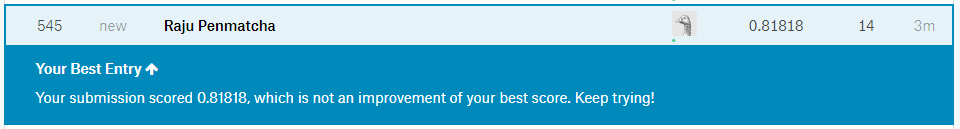

Titanic - a simple solution with a score of 0.818 on Kaggle

At Kaggle.com, the Titanic problem is the simplest of all but it carries sufficient challenges that one can learn a lot from it. In this exercise I will show you a simple, yet good, solution.

Objective: in the Titanic challenge our objective is to build a predictive model that will accurately predict who could have survived and who couldn't.

Prerequisites: you need to know some Python or at least some experience with any programming language. If you have dealt with data analysis in the past and also know some statistics that will help, but it is not mandatory.

Process: all machine learning problems are solved using the following basic steps: 1) Understand data (known as exploratory data analysis) 2) Prepare data (imputation of missing values, data transformation) 3) Feature engineering & selection (create new features, drop unnecessary features) 4) Model development 5) Making predictions

